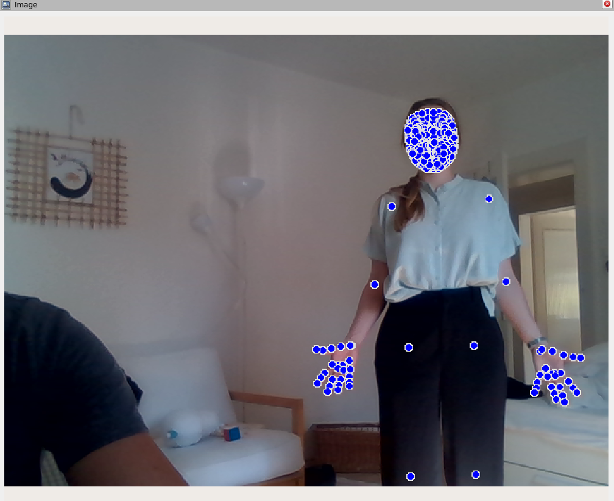

# ros2-face-hand-pose-landmarks-detection
This repo allows you to use Mediapipe's Holistic(Pose Landmark, Hand Landmark, and Face Landmark Detection) for ros2

## Overview
This package allows you to detect face landmarks, hand landmarks, and pose landmarks in the input image.  
This is only tested in ROS humble. However, it should work with other ROS2 versions.  

This package is using [Mediapipe Holistic](https://github.com/google/mediapipe/blob/master/docs/solutions/holistic.md). Check more about it on their website.

## Installation
### Running in Docker
1. `bash build.sh`
2. `cd docker`
3. `docker compose up`
4. `docker exec -it face_hand_pose_detection bash`
5. `ros2 launch face_hand_pose_detection face_hand_pose_detection.launch.py`

## Usage
Run the main node with  
`ros2 launch face_hand_pose_detection face_hand_pose_detection.launch.py`

## Config files
### face_hand_pose_detection.yaml
Contains parameters for `face_hand_pose_detection_node.py`

## Launch files
### face_hand_pose_detection.launch.py
Launches `face_hand_pose_detection_node.py`  
All the parameters for this launch file are described in the Nodes section.

## Nodes
### face_hand_pose_detection_node.py
1. Subscribe to a camera topic
2. Detect face landmarks, hand landmarks, and pose landmarks in the given image
3. Publish the result image

#### Subscribed topics
| Topic | Message Type | Description |
|-------|---|---|
| /camera/color/image_raw | sensor_msgs/Image | Input for landmark detection |

#### Published topics
| Topic | Message Type | Description |
|-------|---|---|
| /face_hand_pose_detection/image | sensor_msgs/Image | Image with landmarks |
| /face_hand_pose_detection/result | face_hand_pose_detection_msgs/DetectionResult | results of landmark detection|

DetectionResult:
- face_landmarks
- right_hand_landmarks
- left_hand_landmarks
- pose_landmarks
- pose_world_landmarks

#### Parameters
| Name | Type | Default | Description |
|-------|---|---|---|
| topic_image | str | "/camera/color/image_raw" | Topic name for RGB image |
